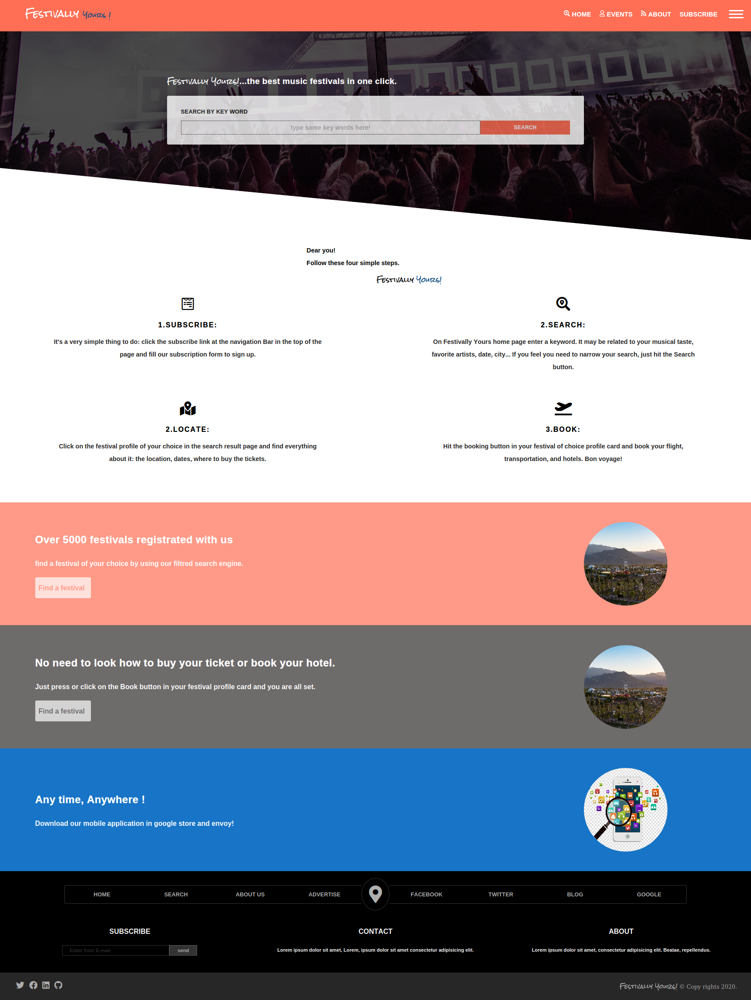
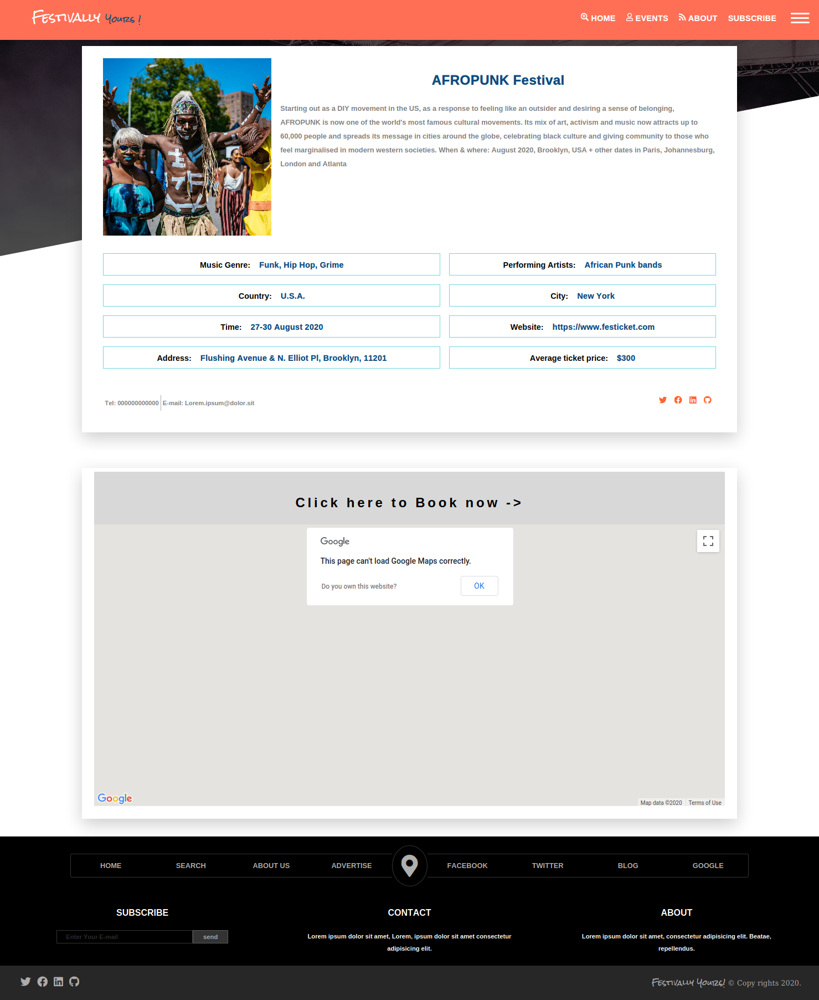
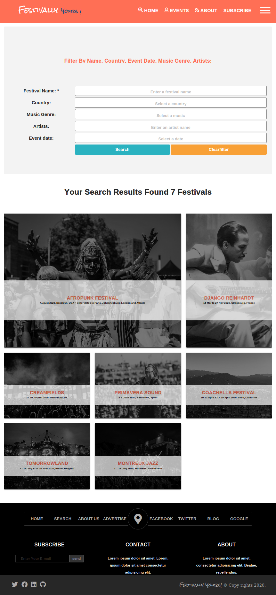
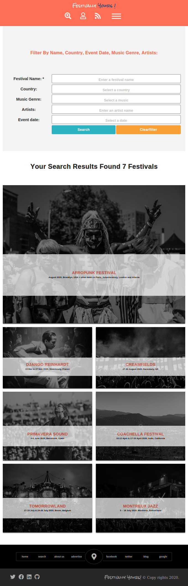

# **Microverse Html/Css Capstone Project**

## Creating a responsive web page with Bootstrap

## Description:

In this project I build a Web-page from scratch based on a given [UX design](https://www.behance.net/gallery/25563385/PatashuleKE) with HTML and CSS.

The web-page is responsive in 3 different screen sizes:

- Mobile version : up to 768px;
- Tablet version: up to 1024px;
- Desktop version: from 1024px.

## Built With:

- HTML & CSS
- SASS
- Verry little JavaScript code.

## Workflow:

1. I installed NPM and NodeJs
2. I set up the node-sass watcher with npm.
3. I created a Gitignore file and "gitignore"-ed the node-modules folder
4. In my branch, I created a "dist" folder where i have my pure HTML and CSS files , and a "scss" folder where I have my Scss modules files
5. In my Scss, I worked with modules that have been used in the main.scss. Those modules are:
   5.0. Setting up the Overall parameters, variables (typography, colors palette), functions and mixins in \_config.scss
   5.1. Setting up all the navigation styling in \_navigation.scss file
   5.2. Setting up all the forms styling in \_forms.scss file
   5.3. Setting up the animations used in the project in the \_animation.scss file
   5.4. Setting up the cards styling in the \_card.scss file

## Code Review Tools:

- [W3 HTML Validator](https://validator.w3.org/)
- CSS linter : [Stickler](https://stickler-ci.com/)
- The fabulous Microverse's team of reviewers:)

## Environement:

- IDE: Visual Studio Code
- Control version : Git
- Chrome and Firefox web browsers

## Usage:

```Git
git clone https://github.com/CalyCherkaoui/CapstoneProject-FestivallyYours.git
cd CapstoneProject-FestivallyYours
git checkout development
firefox index.html
```

## Live Demo:

[Click here to see a live version of the project hosted on GitHack](https://rawcdn.githack.com/CalyCherkaoui/CapstoneProject-FestivallyYours/f31dfa477b22599ff7da402ca27657c5e244f7e0/dist/index.html)

## Author:

👩 **Houda Cherkaoui**

- Twitter: https://twitter.com/Houda59579688
- Github: https://github.com/CalyCherkaoui/
- Linkedin: https://www.linkedin.com/in/houda-cherkaoui-64106395/

## References, credits, and copyrights used in this learning project:

### The UX design:

- Design idea by [Mathew Njuguna](https://www.behance.net/mathewnjuguna)

### Some useful and handy codepen and tools :

- "Erik Terwan" [codepen](https://codepen.io/erikterwan/pen/EVzeRP)
- "Thomas Vaeth" [codepen](https://codepen.io/thomasvaeth/pen/JKxRNk)
- "Bennett Feely" [clip path maker](https://bennettfeely.com/clippy/)

## Page content :

- Photos and text credits to [festicket.com Magazine](https://www.festicket.com/)
- Just for learning purpose: I add some content to my page from the ["TOP 50: The Best Music Festivals in the World 2020" article](https://www.festicket.com/magazine/discover/top-50-best-music-festivals-world/) of the [festicket.com Magazine](https://www.festicket.com/).

### Acknowledgments:

- Microverse
- css-tricks.com
- Github

## Contributing and support:

Pull requests are welcome. For major changes, please open an issue first to discuss what you would like to change.
Show your support to this project with a ⭐️ and let me now if you would like to become a contributor!

## Screenshots Demo of the project:

### Screenshot of the desktop version:

  

### Screenshot of the tablet version:

  

### Screenshot of the mobile version:

  
